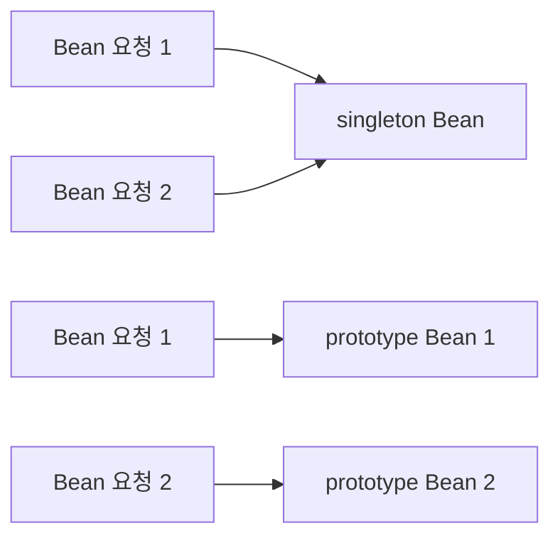

Spring Bean의 생명주기가 내부에서 어떻게 동작하는지 기록한다.

먼저 Bean이 무엇인지 정리하고, 이를 이해하기 위해 Spring의 핵심 개념인 IoC와 DI를 기록한다.

# Spring Bean

Bean은 Spring IoC 컨테이너가 생성하고 관리하는 객체로, Spring 애플리케이션을 구성하는 기본 단위이다.

쉽게 말하면, 개발자가 만든 객체 중 Spring이 대신 생성하고 보관하며 필요할 때 꺼내 쓸 수 있도록 관리하는 객체가 Bean이다. 즉, 애플리케이션의 모든 객체가 Bean이 되는 것은 아니고, Spring 컨테이너에 등록된 객체만 Bean이라고 부른다.

예를 들어 아래와 같은 클래스가 Spring의 관리 대상으로 등록되면, 이 객체는 Spring Bean으로 다뤄진다.

```java
@Component
public class OrderService {
}
```

이 경우 개발자가 `new OrderService()`로 직접 객체를 생성하지 않아도, Spring 컨테이너가 Bean으로 생성하고 관리한다. 또한 `@Component` 외에도 역할에 따라 `@Controller`, `@Service`, `@Repository`, `@Configuration` 같은 어노테이션으로도 Bean을 등록할 수 있다.

Spring Bean의 기본 스코프는 `singleton`이다. 따라서 같은 Bean을 여러 곳에서 사용하더라도 매번 새로운 객체를 만드는 것이 아니라, 하나의 인스턴스를 생성해 재사용한다. 이 방식은 불필요한 객체 생성을 줄여 메모리 사용 측면에서 효율적이다. Bean도 결국 Java 객체이므로 힙(Heap) 영역에 생성되지만, Spring은 이를 컨테이너 차원에서 관리하고 재사용한다.

반대로 `prototype` 스코프는 Bean을 요청할 때마다 새로운 객체를 생성한다. 즉, Spring Bean이 항상 싱글톤인 것은 아니지만, 기본값은 `singleton`이다.



다만 싱글톤 방식이 항상 장점만 있는 것은 아니다. 하나의 객체를 여러 곳에서 함께 사용하기 때문에, Bean 내부에 상태를 변경하는 필드가 있으면 예상치 못한 값 공유나 동시성 문제가 생길 수 있다. 그래서 싱글톤 Bean은 가능한 한 상태를 갖지 않는(stateless) 방식으로 설계하는 것이 중요하다.

간단한 예시로 확인해 보면, 같은 Bean을 두 번 조회해도 같은 객체가 반환된다.

```java
ApplicationContext context =
        new AnnotationConfigApplicationContext(AppConfig.class);

OrderService bean1 = context.getBean(OrderService.class);
OrderService bean2 = context.getBean(OrderService.class);

System.out.print(bean1 == bean2); // true
```

반대로 `prototype` 스코프로 설정하면 Bean을 조회할 때마다 새로운 객체가 생성된다.

```java
@Scope("prototype")
@Component
public class OrderService {
}

ApplicationContext context =
        new AnnotationConfigApplicationContext(AppConfig.class);

OrderService bean1 = context.getBean(OrderService.class);
OrderService bean2 = context.getBean(OrderService.class);

System.out.print(bean1 == bean2); // false
```

즉, `singleton`은 같은 Bean 인스턴스를 재사용하고, `prototype`은 요청할 때마다 새로운 객체를 반환한다.

# Spring IoC Container

IoC(Inversion of Control, 제어의 역전)는 객체의 생성과 의존관계 관리에 대한 제어권을 애플리케이션 코드가 직접 가지지 않고, Spring 컨테이너가 대신 담당하도록 하는 원칙이다.

핵심은 객체를 사용하는 쪽이 더 이상 객체 생성과 조립의 주도권을 갖지 않는다는 점이다. 개발자가 필요한 객체를 직접 만들고 연결하는 대신, 컨테이너가 객체를 만들고 필요한 관계를 구성하면서 애플리케이션 전반의 흐름을 관리한다.

```mermaid
flowchart LR
    A[개발자 코드] -->|직접 생성| B[new OrderRepository()]
    B --> C[new OrderService(orderRepository)]

    D[개발자 코드] -->|요청| E[Spring Container]
    E --> F[OrderRepository 생성]
    E --> G[OrderService 생성]
    F --> G
```

코드로 보면 차이가 더 잘 드러난다. Spring을 사용하지 않을 때는 개발자가 직접 객체를 생성하고 의존관계를 연결해야 한다.

```java
OrderRepository orderRepository = new OrderRepository();
OrderService orderService = new OrderService(orderRepository);
```

반면 Spring에서는 어떤 객체를 만들고 연결할지에 대한 제어를 컨테이너가 담당한다.

```java
ApplicationContext context =
        new AnnotationConfigApplicationContext(AppConfig.class);

OrderService orderService = context.getBean(OrderService.class);
```

즉, 객체 생성과 조립의 주도권이 개발자 코드에서 Spring 컨테이너로 넘어가는 것이 IoC이다.

# Spring DI

DI(Dependency Injection, 의존성 주입)는 IoC를 구현하는 대표적인 방식으로, 객체가 필요로 하는 의존 객체를 스스로 생성하거나 조회하지 않고 외부 컨테이너가 주입해 주는 방식을 말한다.

의존 관계가 필요한 이유는 하나의 객체가 모든 일을 혼자 처리하지 않기 때문이다. 예를 들어 주문 서비스는 주문을 처리하는 역할에 집중하고, 실제 저장은 주문 레포지토리 같은 다른 객체가 맡는 편이 역할 분리에 더 적절하다.

즉, `OrderService`가 `OrderRepository`의 기능을 사용해야 한다면 둘 사이에는 의존 관계가 생긴다. 여기서 중요한 점은 의존 관계 자체가 문제인 것이 아니라, 그 의존 객체를 누가 만들고 연결하느냐이다.

예를 들어 아래 코드는 `OrderService`가 `OrderRepository`를 직접 생성하고 있다.

```java
public class OrderService {
    private final OrderRepository orderRepository = new OrderRepository();
}
```

이 경우에도 의존 관계는 존재한다. 다만 `OrderService`가 자신의 역할만 수행하는 것이 아니라, 어떤 구현 객체를 쓸지 선택하고 생성하는 책임까지 함께 떠안게 된다.

반면 DI는 객체가 필요로 하는 의존 객체를 스스로 만들지 않고 외부에서 받아 사용하는 방식이다.

```java
@Component
public class OrderService {
    private final OrderRepository orderRepository;

    public OrderService(OrderRepository orderRepository) {
        this.orderRepository = orderRepository;
    }
}
```

이 경우 `OrderService`는 의존 객체를 직접 만들지 않고, Spring 컨테이너가 주입해 준 `OrderRepository`를 사용하게 된다. 즉, 객체는 자신의 역할에 집중하고, 의존관계의 생성과 연결은 컨테이너가 담당한다.

정리하면 직접 생성 방식과 DI 방식의 차이는 의존 객체를 누가 생성하고 연결하느냐에 있다. 직접 생성 방식에서는 객체 자신이 그 책임을 지고, DI 방식에서는 외부 컨테이너가 그 책임을 맡는다.

의존성 주입 방식에는 대표적으로 필드 주입, setter 주입, 생성자 주입이 있다. 차이는 결국 Spring 컨테이너가 의존성을 어느 시점에, 어떤 방식으로 넣어 주느냐에 있다.

## 1. 필드 주입

필드 주입은 컨테이너가 객체를 먼저 만든 뒤, 리플렉션으로 필드에 바로 값을 넣는 방식이다.

리플렉션은 클래스의 필드나 메서드에 런타임에 접근하는 방식이다. Spring은 필드 주입에서 이 기능을 사용해, 개발자가 직접 setter를 만들지 않아도 private 필드에 값을 넣을 수 있다.

```java
@Service
public class OrderService {
    @Autowired
    private OrderRepository orderRepository;

    public void order(String itemName) {
        orderRepository.save(itemName);
    }
}
```

컨테이너 관점에서 보면 흐름은 아래와 비슷하다.

```java
OrderService orderService = new OrderService();
// reflection으로 orderRepository 필드에 주입
```

코드만 보면 짧고 간단해 보이지만, 이 클래스가 `OrderRepository` 없이는 동작할 수 없는 객체라는 점이 생성 시점에 분명하게 드러나지 않는다. 또한 Spring 컨테이너 밖에서 직접 테스트하려고 하면 의존성을 넣어 줄 생성자나 setter가 없어 다루기가 불편하다.

```java
OrderService orderService = new OrderService();
// orderRepository를 직접 넣어 줄 방법이 없다.
```

## 2. setter 주입

setter 주입은 컨테이너가 객체를 먼저 만든 뒤, setter 메서드를 호출해서 의존성을 넣는 방식이다.

```java
@Service
public class OrderService {
    private OrderRepository orderRepository;

    @Autowired
    public void setOrderRepository(OrderRepository orderRepository) {
        this.orderRepository = orderRepository;
    }

    public void order(String itemName) {
        orderRepository.save(itemName);
    }
}
```

컨테이너 관점에서 보면 흐름은 아래와 비슷하다.

```java
OrderService orderService = new OrderService();
orderService.setOrderRepository(orderRepository);
```

즉, setter 주입은 객체 생성과 의존성 주입이 분리되어 있다. 필요하면 의존성을 선택적으로 주입하거나 교체할 수 있다는 점은 장점이지만, setter가 호출되기 전까지는 객체가 완전한 상태라고 보장하기 어렵다.

테스트 코드는 필드 주입보다 낫다. 컨테이너 없이도 setter를 직접 호출해 의존성을 넣을 수 있기 때문이다.

```java
OrderService orderService = new OrderService();
orderService.setOrderRepository(new MemoryOrderRepository());
```

## 3. 생성자 주입

생성자 주입은 컨테이너가 생성자를 호출하는 시점에 의존성을 함께 넘겨 주는 방식이다.

```java
@Service
public class OrderService {
    private final OrderRepository orderRepository;

    public OrderService(OrderRepository orderRepository) {
        this.orderRepository = orderRepository;
    }

    public void order(String itemName) {
        orderRepository.save(itemName);
    }
}
```

컨테이너 관점에서 보면 흐름은 아래와 비슷하다.

```java
OrderService orderService = new OrderService(orderRepository);
```

이 방식은 객체를 만드는 시점에 어떤 의존성이 필요한지가 코드에서 바로 드러난다. 객체가 생성되는 순간 필요한 의존성이 모두 전달되므로, 생성 직후부터 완전한 상태라고 볼 수 있다. 또한 `final`을 사용할 수 있어서 의존성이 한번 주입된 뒤 바뀌지 않도록 만들 수 있다.

테스트 코드도 가장 단순하다.

```java
OrderRepository orderRepository = new MemoryOrderRepository();
OrderService orderService = new OrderService(orderRepository);
```

정리하면 필드 주입과 setter 주입은 "객체를 먼저 만들고 나중에 주입"하는 방식이고, 생성자 주입은 "객체를 만드는 순간 의존성을 함께 전달"하는 방식이다. 그래서 필수 의존성에는 일반적으로 생성자 주입이 더 권장된다.

# Spring Bean 생명주기

Bean 생명주기는 Spring 컨테이너가 객체를 단순히 생성하는 데서 끝나지 않고, BeanDefinition을 등록하고, 실제 객체를 만들고, 의존성을 주입하고, 초기화한 뒤, 컨테이너 종료 시점에 소멸 과정까지 관리하는 전체 흐름이다.

실무에서는 보통 `ApplicationContext`를 직접 다루지만, 실제 Bean 생성과 조회의 핵심 동작은 내부 `BeanFactory`를 기반으로 이루어진다. 즉, `ApplicationContext`는 더 넓은 기능을 제공하는 상위 컨테이너이고, Bean 생명주기의 중심에는 `BeanFactory`가 있다고 이해하면 된다.

또한 컨테이너는 Bean 클래스를 바로 객체로 만들지 않는다. 먼저 Bean을 어떤 클래스로 만들고, 어떤 스코프를 가지며, 어떤 초기화와 소멸 메서드를 사용할지를 `BeanDefinition`이라는 메타데이터로 등록한 뒤, 그 정보를 바탕으로 실제 Bean을 생성한다.

```mermaid
flowchart TD
    A[SpringApplication.run()] --> B[ApplicationContext 구현체 생성]
    B --> C[BeanFactory 준비]
    C --> D[ComponentScan 수행]
    D --> E[BeanDefinition 등록]
    E --> F[Bean 인스턴스 생성]
    F --> G[의존성 주입]
    G --> H[Aware 콜백]
    H --> I[BeanPostProcessor before]
    I --> J[초기화 콜백]
    J --> K[BeanPostProcessor after]
    K --> L[애플리케이션에서 사용]
    L --> M[컨테이너 종료]
    M --> N[소멸 콜백]
```

## 1. ApplicationContext 생성과 refresh()

Spring Boot 애플리케이션에서는 보통 `main()` 메서드에서 `SpringApplication.run()`이 호출되면서 전체 흐름이 시작된다.

```java
@SpringBootApplication
public class DemoApplication {

    public static void main(String[] args) {
        SpringApplication.run(DemoApplication.class, args);
    }
}
```

실제 `SpringApplication`의 진입점도 비교적 단순하다.

```java
// SpringApplication#run(Class<?>, String...)
public static ConfigurableApplicationContext run(Class<?> primarySource, String... args) {
    return run(new Class<?>[] { primarySource }, args);
}

// SpringApplication#run(Class<?>[], String[])
public static ConfigurableApplicationContext run(Class<?>[] primarySources, String[] args) {
    return new SpringApplication(primarySources).run(args);
}
```

그 다음 `run(args)` 내부에서는 대략 다음 순서로 진행된다.

```java
// SpringApplication#run(String...)
context = createApplicationContext();
prepareContext(...);
refreshContext(context);
afterRefresh(context, applicationArguments);
```

여기서 웹 애플리케이션이라면 기본적으로 `AnnotationConfigServletWebServerApplicationContext` 같은 웹용 `ApplicationContext` 구현체가 선택된다. 그리고 이후 `refresh()`가 호출되면서 Bean 등록과 생성, 초기화가 본격적으로 시작된다.

## 2. BeanDefinition 등록

Bean 생성보다 먼저 일어나는 일은 BeanDefinition 등록이다. `@SpringBootApplication` 안에는 `@ComponentScan`이 포함되어 있기 때문에, Spring은 애플리케이션의 베이스 패키지부터 내려가며 `@Component`, `@Service`, `@Repository`, `@Controller`, `@Configuration`, `@RestController` 같은 stereotype 어노테이션이 붙은 클래스를 찾는다.

이때 Spring은 발견한 클래스를 곧바로 객체로 만들지 않고, 먼저 `BeanDefinition` 형태의 메타데이터로 등록한다. `BeanDefinition`에는 대략 다음과 같은 정보가 담긴다.

- 어떤 클래스로 Bean을 만들지
- 어떤 스코프를 사용할지 (`singleton`, `prototype`)
- 생성자와 의존성 주입에 필요한 정보
- 초기화 메서드와 소멸 메서드 정보
- lazy-init 여부 같은 생성 전략

즉, 이 단계는 "객체 생성"이 아니라 "어떻게 생성할지에 대한 설계도 등록" 단계에 가깝다.

## 3. Bean 생성 시작

`refresh()` 과정이 진행되면 컨테이너는 내부 `BeanFactory`를 준비한다.

```java
// AbstractApplicationContext#refresh()
finishBeanFactoryInitialization(beanFactory);
finishRefresh();

// AbstractApplicationContext#finishBeanFactoryInitialization()
beanFactory.preInstantiateSingletons();
```

그리고 컨테이너가 완전히 준비되는 마지막 시점에 non-lazy singleton Bean들이 한꺼번에 생성되기 시작한다고 볼 수 있다.

Bean 하나를 가져오는 핵심 진입점은 `AbstractBeanFactory#doGetBean()`이다. 이 메서드는 먼저 singleton 캐시를 확인하고, 없으면 실제 생성 로직으로 들어간다.

```java
// AbstractBeanFactory#doGetBean()
if (mbd.isSingleton()) {
    sharedInstance = getSingleton(beanName, () -> {
        try {
            return createBean(beanName, mbd, args);
        }
        catch (BeansException ex) {
            destroySingleton(beanName);
            throw ex;
        }
    });
}
```

그리고 실제 객체 인스턴스 생성은 `AbstractAutowireCapableBeanFactory#doCreateBean()`에서 이루어진다.

```java
// AbstractAutowireCapableBeanFactory#doCreateBean()
if (instanceWrapper == null) {
    instanceWrapper = createBeanInstance(beanName, mbd, args);
}
Object bean = instanceWrapper.getWrappedInstance();
Class<?> beanType = instanceWrapper.getWrappedClass();
```

여기서 `createBeanInstance()`는 생성자를 선택하고 순수한 자바 객체를 만드는 단계이다. 아직 이 시점의 객체는 의존성 주입과 초기화가 끝나지 않은 상태다.

## 4. 의존성 주입과 초기화

객체 인스턴스가 만들어지면 그 다음에는 의존성 주입과 초기화가 이어진다.

```java
// AbstractAutowireCapableBeanFactory#doCreateBean()
Object exposedObject = bean;
try {
    populateBean(beanName, mbd, instanceWrapper);
    exposedObject = initializeBean(beanName, exposedObject, mbd);
}
```

`populateBean()`은 의존성 주입을 담당하고, `initializeBean()`은 Aware 처리, `BeanPostProcessor`, 초기화 콜백 실행까지 이어지는 핵심 단계다.

```java
// AbstractAutowireCapableBeanFactory#initializeBean()
invokeAwareMethods(beanName, bean);

Object wrappedBean = bean;
if (mbd == null || !mbd.isSynthetic()) {
    wrappedBean = applyBeanPostProcessorsBeforeInitialization(wrappedBean, beanName);
}

invokeInitMethods(beanName, wrappedBean, mbd);
wrappedBean = applyBeanPostProcessorsAfterInitialization(wrappedBean, beanName);
```

즉, 초기화 단계는 단순히 `@PostConstruct` 한 번 호출되는 정도가 아니다. 먼저 `Aware` 관련 값이 주입되고, 그 다음 `BeanPostProcessor#postProcessBeforeInitialization()`이 실행되며, 이후 `InitializingBean#afterPropertiesSet()`, 커스텀 `init-method`, `@PostConstruct` 같은 초기화 로직이 적용된다. 마지막으로 `BeanPostProcessor#postProcessAfterInitialization()`이 실행되면서 필요하면 Bean이 프록시 객체로 바뀔 수도 있다.

예를 들어 아래처럼 작성한 콜백은 이 초기화와 소멸 구간에 연결된다.

```java
@Component
public class OrderService {

    @PostConstruct
    public void init() {
        System.out.println("OrderService init");
    }

    @PreDestroy
    public void destroy() {
        System.out.println("OrderService destroy");
    }
}
```

## 5. 사용과 소멸

초기화가 끝난 Bean은 이후 애플리케이션 전반에서 주입되어 사용된다. 이 시점에는 이미 의존성 주입과 초기화가 끝난 상태이므로, 다른 Bean은 준비가 완료된 객체를 받아 사용하게 된다.

```java
@Component
public class OrderRunner {
    private final OrderService orderService;

    public OrderRunner(OrderService orderService) {
        this.orderService = orderService;
    }

    public void run() {
        orderService.order("coffee");
    }
}
```

컨테이너가 종료되면 singleton Bean에 대해서는 소멸 콜백이 호출된다. 가장 단순하게는 `ConfigurableApplicationContext#close()`를 호출하면 된다.

```java
ConfigurableApplicationContext context =
        new AnnotationConfigApplicationContext(AppConfig.class);

OrderService orderService = context.getBean(OrderService.class);
orderService.order("coffee");

context.close();
```

이때 Bean에 `@PreDestroy`가 붙어 있다면 종료 시점에 해당 메서드가 호출된다.

반면 prototype Bean은 생성과 의존성 주입, 초기화까지만 컨테이너가 관여하고, 이후의 생명주기 관리와 소멸 처리는 컨테이너가 책임지지 않는다. 그래서 컨텍스트를 닫아도 prototype Bean의 소멸 콜백은 자동으로 호출되지 않는다.

```java
@Scope("prototype")
@Component
public class PrototypeBean {

    @PostConstruct
    public void init() {
        System.out.println("PrototypeBean init");
    }

    @PreDestroy
    public void destroy() {
        System.out.println("PrototypeBean destroy");
    }
}

ConfigurableApplicationContext context =
        new AnnotationConfigApplicationContext(AppConfig.class);

PrototypeBean prototypeBean = context.getBean(PrototypeBean.class);
context.close();
```

위 코드에서는 `init()`은 호출되지만, `destroy()`는 자동으로 호출되지 않는다. 즉, prototype Bean은 만들어서 넘겨준 뒤의 정리 책임이 호출한 쪽에 더 가깝다.

정리하면 Spring Bean 생명주기는 ApplicationContext 준비, BeanDefinition 등록, 객체 생성, 의존성 주입, 초기화, 사용, 소멸까지 이어지는 전체 관리 흐름이다. 이 흐름을 이해해야 `@PostConstruct`, AOP 프록시, 싱글톤과 프로토타입의 차이, 컨테이너 확장 포인트가 하나의 맥락 안에서 연결된다.

---

#### 출처

- https://docs.spring.io/spring-framework/reference/core.html
